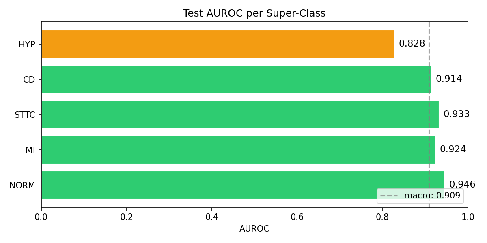
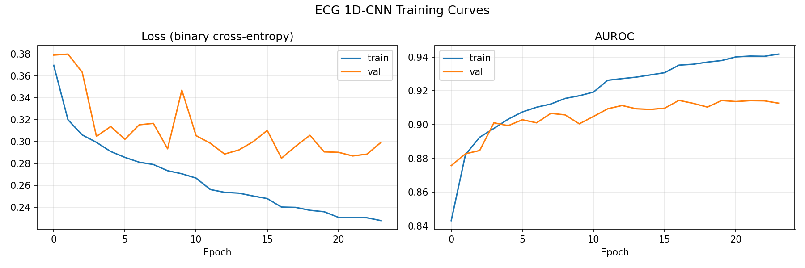
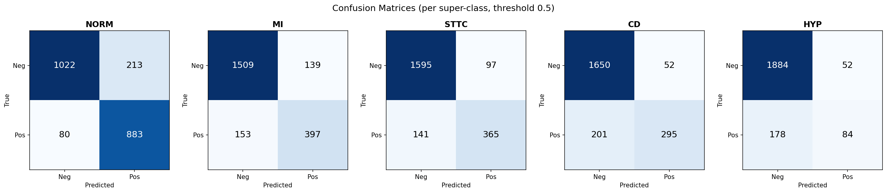
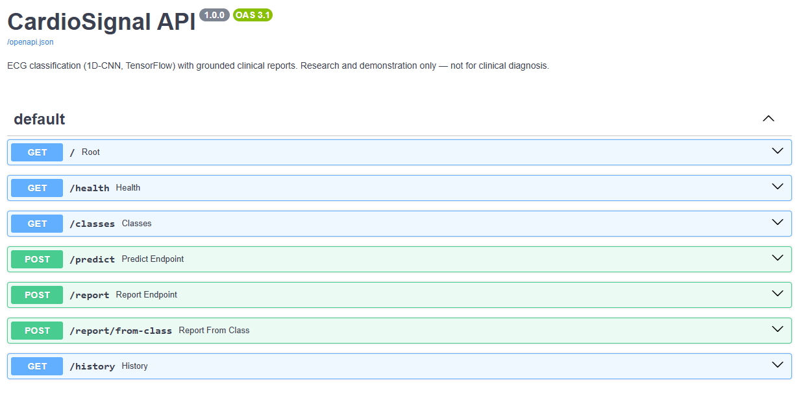
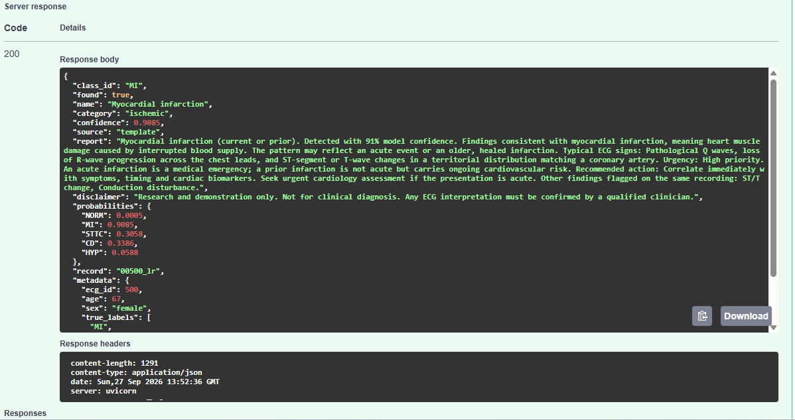
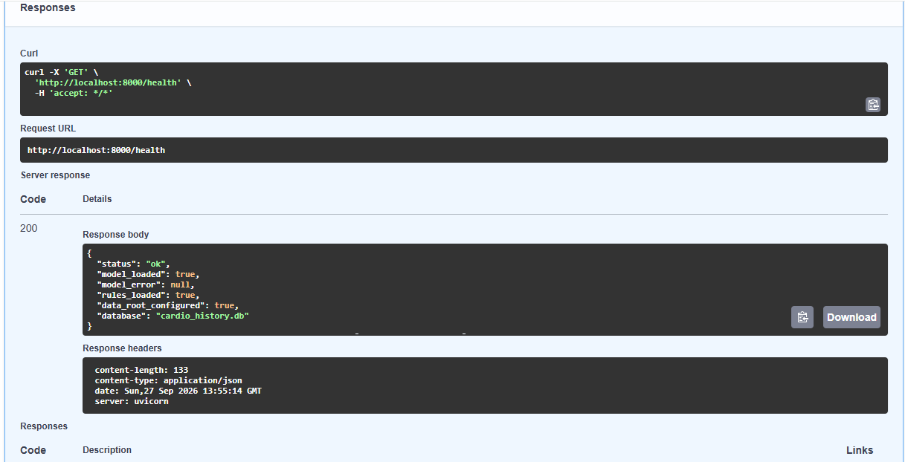
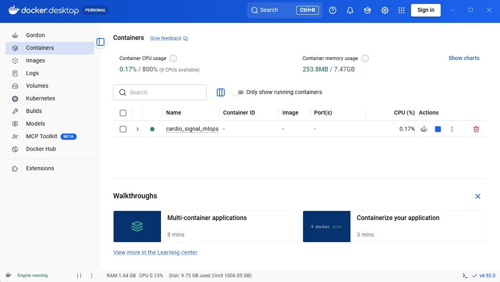
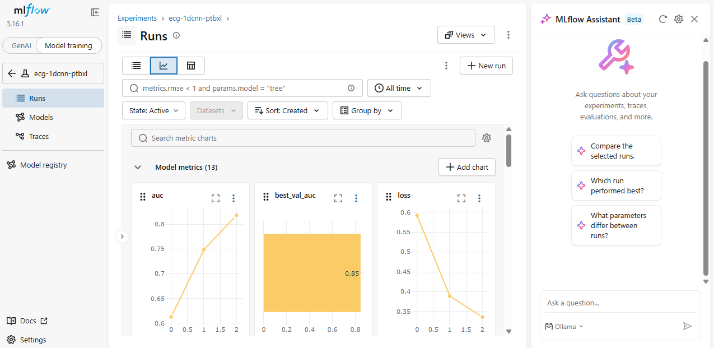

# CardioSignal — ECG Classification with Grounded Clinical Reports

> **An end-to-end, CPU-only MLOps pipeline that classifies 12-lead ECGs into five diagnostic super-classes and generates clinical reports grounded in a verified rule base — served by FastAPI, containerised with Docker, and tracked with MLflow.**


---

## TL;DR

Interpreting an ECG requires a trained cardiologist — a bottleneck in overloaded or underserved settings. This project builds the *whole* chain from raw signal to deployed service, where each layer demonstrates a distinct engineering skill:

- Fine-tunes a compact **1D-CNN (125 k parameters)** in TensorFlow/Keras on **PTB-XL** (21 799 clinical ECGs), reaching **0.909 macro-AUROC** on the official held-out test fold — trained entirely on **CPU in 17 minutes**.
- Turns each prediction into a **grounded clinical report**: a local LLM reformulates a verified rule card and is forbidden to add anything, with a **deterministic fallback that cannot hallucinate**.
- Serves the pipeline through a **FastAPI** REST API with a **SQLite** prediction history, packaged in a **Docker** container.
- Industrialises the whole thing with **MLflow** experiment tracking, **GitHub Actions** CI, and **18 unit tests**.

> **Disclaimer:** research and demonstration only. This system must not be used for clinical diagnosis.

---

## Headline result



A 125 k-parameter model reaches **0.909 macro-AUROC** across five diagnostic super-classes on the PTB-XL test fold — on CPU, in 17 minutes, with no GPU at any stage.

---

## Why this matters

Most ML projects stop at the model: a notebook with a good score. In practice, that model is useless until it can be **served, reproduced, monitored, and explained**.

Two gaps are addressed here specifically:

**Deployment gap.** A `.keras` file on a laptop is not a system. This repository takes the model through API serving, containerisation, experiment tracking and continuous integration — the path a model actually takes to production.

**Explanation gap.** A classifier that outputs `MI: 0.91` tells a clinician nothing actionable. But letting an LLM explain it freely invites **hallucination** — invented thresholds, invented drugs, invented urgency. This project shows the middle path: **retrieval-augmented generation grounded in a verified rule base**, where the model is a *writer*, never a *source*.

---

## Method

### 1. Signal processing

Each 10-second, 12-lead recording (100 Hz, shape `1000 × 12`) is cleaned before it reaches the network:

```
Butterworth bandpass 0.5–40 Hz  (zero-phase, sosfiltfilt)
  -> removes baseline wander (breathing, electrode drift) below 0.5 Hz
  -> removes power-line and muscle noise above 40 Hz
per-lead z-score normalisation
  -> cancels inter-patient amplitude variation (build, electrode placement, skin impedance)
```

Zero-phase filtering matters here: a standard filter shifts the signal in time, and in an ECG the exact position of the waves carries the diagnosis.

### 2. 1D-CNN architecture (125,125 parameters)

```
Input: 12-lead ECG  (1000, 12)
         |
         v
Block 1   Conv1D(32, k=7) x2 + BN + ReLU -> MaxPool(2) -> Dropout(0.2)   (500, 32)
Block 2   Conv1D(64, k=5) x2 + BN + ReLU -> MaxPool(2) -> Dropout(0.2)   (250, 64)
Block 3   Conv1D(128, k=3) x2 + BN + ReLU -> MaxPool(2) -> Dropout(0.3)  (125, 128)
         |
         v   collapse the time axis
GlobalAveragePooling1D                                                    (128)
Dense(64) + ReLU + Dropout(0.3)                                           (64)
Dense(5, sigmoid)                                                         (5)
```

Filters widen (32 → 64 → 128) while the time axis shrinks: early layers capture individual waves, later layers capture full QRS complexes and inter-beat relationships.

**Sigmoid, not softmax.** PTB-XL is genuinely **multi-label** — one ECG can carry MI *and* ST/T change *and* a conduction disturbance simultaneously. Softmax would force the probabilities to compete; sigmoid scores each class independently, with binary cross-entropy as the loss.

### 3. Grounded clinical report

```
predicted class  ->  retrieve the rule card from ecg_rules.json
                 ->  build a prompt: fixed instructions + that single card
                 ->  local LLM (Ollama) reformulates, forbidden to add anything
                 ->  OR deterministic template if no LLM is reachable
```

Five levers keep the generation anchored: the source is *in* the prompt, the instruction is explicit and negative, the card is delimited by markers, the model is allowed to stay silent on missing facts, and temperature is held at 0.1 for clinical consistency.

The deterministic fallback is the reference mode: it only reorders text a human wrote and validated, so hallucination is structurally impossible. The LLM is the comfort layer, not the safety layer.

**What legitimately differentiates two reports** is not the LLM choosing different words — it is the *computed facts* injected into the card: model confidence and co-detected findings.

---

## Results

### Test-set performance (PTB-XL fold 10, 2 198 ECGs)

| Class | Description | AUROC | Positives |
|---|---|:---:|:---:|
| **NORM** | Normal ECG | **0.946** | 963 |
| **STTC** | ST/T change | **0.933** | 506 |
| **MI** | Myocardial infarction | **0.924** | 550 |
| **CD** | Conduction disturbance | **0.915** | 496 |
| **HYP** | Hypertrophy | 0.828 | 262 |
| | **Macro average** | **0.909** | 2 198 |

HYP scores lowest, which is expected: it is the rarest class (12 % of cases) and ECG voltage criteria for hypertrophy are known to be weakly specific even in clinical practice — echocardiography remains the reference there.

### Training curves



24 epochs (early-stopped, best at epoch 17), 16.8 minutes on CPU. The validation AUROC plateaus around 0.914 while training AUROC keeps climbing — the gap is modest, and `EarlyStopping` restores the best weights rather than the last.

### Confusion matrices



One matrix per class at threshold 0.5. Note the asymmetry: the model is conservative on the rarer classes, preferring missed detections over false alarms at this threshold.

### The threshold is a trade-off, not a setting

On a real test case (ECG 500, 67-year-old woman, true labels `MI, STTC, CD, HYP`):

| Threshold | Reported findings | Comment |
|:---:|---|---|
| 0.5 | MI only | MI = 0.91 passes; CD = 0.34 and STTC = 0.31 do not |
| 0.3 | MI + ST/T change + conduction disturbance | Three of the four true findings recovered |

Lowering the threshold raises sensitivity and false-alarm rate together. The API exposes it as a request parameter rather than hard-coding a "best" value.

---

## Pipeline architecture

```
 ECG signal ──▶ [ Signal processing ] ──▶ [ 1D-CNN classifier ] ──▶ 5 probabilities
  (12 leads)     bandpass + z-score        TensorFlow / Keras             │
                                                                          ▼
                                            [ Clinical rules ] ──▶ [ Grounded report ]
                                             5 verified cards      Ollama or template
                                                                          │
                    ┌─────────────────────────────────────────────────────┘
                    ▼
              [ FastAPI ] ──▶ [ SQLite ]        [ MLflow ]      [ GitHub Actions ]
              7 endpoints     history            tracking        lint · rules · tests · build
                    │
              [ Docker ]
              reproducible container
```

### Graceful degradation throughout

Every optional dependency has a fallback, so the pipeline runs end to end on a minimal install:

| If this is missing | The system falls back to | Consequence |
|---|---|---|
| Local LLM (Ollama) | Deterministic template | Less fluent, but hallucination-proof |
| Trained model | API still starts | Rule-based endpoints stay available |
| MLflow | Local files only | Training proceeds normally |
| `.keras` format | `.h5`, then weights-only | Model loads across version drift |

---

## Quickstart

```bash
pip install -r requirements.txt
```

Download PTB-XL — see [`dataset/README.md`](dataset/README.md) for instructions, expected layout and citation.

```bash
# Train
python src/model/train.py --data-root /path/to/ptb-xl --epochs 30

# Evaluate (confusion matrices, AUROC chart, text report)
python src/evaluate.py --data-root /path/to/ptb-xl

# Full pipeline on one ECG: signal -> class -> grounded report
python src/pipeline/predict_and_report.py \
    --data-root /path/to/ptb-xl --ecg-id 500 --threshold 0.3 --no-llm

# Serve the API
uvicorn app.api:app --port 8000        # then open http://localhost:8000/docs

# Or run everything in a container
docker-compose up --build

# Inspect experiments
mlflow ui --backend-store-uri sqlite:///mlflow.db    # http://localhost:5000
```

> **Windows / Anaconda note.** Keep `numpy<2`, `pandas==2.2.2`, `wfdb==4.1.2` and `tensorflow==2.15.0`. These pins are not cosmetic — see *Engineering notes* below.

---

## API

| Method | Endpoint | Purpose |
|---|---|---|
| `GET` | `/health` | Model loaded? Rules valid? Database reachable? |
| `GET` | `/classes` | The five super-classes with their clinical rule cards |
| `POST` | `/predict` | ECG → five class probabilities |
| `POST` | `/report` | ECG → probabilities **and** grounded clinical report |
| `POST` | `/report/from-class` | A class name → report (no model required) |
| `GET` | `/history` | Recent predictions from SQLite |



The interactive documentation is generated automatically by FastAPI from the Pydantic
schemas — no extra code, and it doubles as a manual test harness.

Three design decisions worth noting:

- **The model loads once at startup**, not per request — loading a Keras checkpoint takes seconds.
- **The rule base is validated at startup and blocks the service if invalid.** A medical system should fail loudly rather than serve wrong reports silently.
- **The API starts even without a model.** Rule-based endpoints remain usable, and `/health` says exactly what is missing.



`/health` reports what is actually loaded rather than a bare "OK": the model, the rule
base, the dataset root and the database are each surfaced independently.

### A real grounded report



`POST /report` on ECG 500 (67-year-old woman) at threshold 0.3. The model returns MI at
0.909 and flags ST/T change and conduction disturbance as co-findings — three of the four
labels the cardiologists assigned. Every sentence of the report traces back to the rule
card; the disclaimer travels with the response.

---

## Deployment and tracking

### Container



The API runs as a non-root user inside a `python:3.11-slim` image, with the trained model
mounted as a read-only volume rather than baked in — retraining does not require rebuilding
a 600 MB image. A `HEALTHCHECK` polls `/health` every 30 seconds, so Docker knows whether
the service is genuinely functional and not merely started.

### Experiment tracking



Every training run logs its hyperparameters, per-epoch loss and AUROC, per-class test
AUROC, the generated figures and the model itself into a local SQLite-backed MLflow store.
Tracking is wrapped so that a failure in MLflow can never interrupt a 17-minute training run.

---

## Engineering notes

Five of the six problems encountered building this were **version conflicts** — which is precisely what MLOps exists to control.

| Problem | Cause | Fix |
|---|---|---|
| `DLL load failed` on `import pandas` | An install pulled NumPy 2.x; Anaconda's pandas/pyarrow are built for 1.x | Pin `numpy<2` |
| `KeyError: 'future'` on `import wfdb` | Recent `wfdb` requires `pandas≥2.2.3`, pulling pandas 3.x | Pin `wfdb==4.1.2` with `pandas==2.2.2` |
| `Could not deserialize class 'Functional'` in Docker | `tensorflow>=2.15` installed Keras 3, which cannot read a Keras 2 checkpoint | Pin `tensorflow==2.15.0` |
| `Layer 'conv1d' expected 2 variables, received 0` | `.keras` format sensitive to build differences | Loader tries `.keras` → `.h5` → rebuild + weights-only |
| MLflow refuses the file store | Directory backend deprecated | Track into SQLite; wrap tracking so it can never break a run |

The difference between `>=` ("at least") and `==` ("exactly") is not pedantry: for a trained model, only `==` guarantees the checkpoint will load.

---

## Repository layout

```
app/api.py                       FastAPI service (7 endpoints, SQLite history)
src/data/loader.py               PTB-XL loader: CSV + SCP codes -> 5 super-classes
src/data/preprocess.py           bandpass filter + per-lead z-score normalisation
src/model/classifier.py          1D-CNN architecture (TensorFlow / Keras)
src/model/train.py               training loop + MLflow tracking
src/evaluate.py                  confusion matrices, AUROC chart, text report
src/report/rules.py              clinical rule-base loader + strict validator
src/report/explain.py            grounded report (Ollama, template fallback)
src/pipeline/predict_and_report.py   ECG -> probabilities -> report
data/clinical_rules/ecg_rules.json   5 verified clinical rule cards
tests/test_report.py             18 unit tests (run in CI)
.github/workflows/ci.yml         lint · validate rules · tests · Docker build
Dockerfile · docker-compose.yml  containerisation
figures/ · results/              generated plots, screenshots and reports
dataset/README.md                download instructions and citation
```

---

## About the author

**Hanene Rouabeh** — Ph.D. in Computer Systems Engineering, 15 years of experience across embedded systems (STM32, FPGA/VHDL, PCB design), signal and image processing, control systems, and applied machine learning (CNN, Transformer, ESN) with PyTorch and TensorFlow. Six international journal publications, one patent, and a strong preference for reproducible, well-documented research code.

- GitHub: [@HaneneRBH](https://github.com/HaneneRBH)
- Email: hanene.rouabeh@gmail.com

**Companion repositories:**

- [traffic_sign_adas_copilot](https://github.com/HaneneRBH/traffic_sign_adas_copilot) — CPU ADAS pipeline: MobileNetV3 perception, RAG grounded explanations, RL speed policy, Streamlit demo
- [Adversarial_Robust_Traffic_Signs_PGD_PyTorch](https://github.com/HaneneRBH/Adversarial_Robust_Traffic_Signs_PGD_PyTorch) — PyTorch CNN + PGD/TRADES adversarial training on GTSRB
- [Lora_rffi_robuste_pytorch](https://github.com/HaneneRBH/Lora_rffi_robuste_pytorch) — CNN2D + Transformer for cross-channel-robust RF fingerprinting
- [Local_LLM_Agent_Irrigation](https://github.com/HaneneRBH/Local_LLM_Agent_Irrigation) — privacy-first agentic AI with local LLM + LangChain for IoT

---

## References

- Wagner, P., Strodthoff, N., Bousseljot, R.-D., Kreiseler, D., Lunze, F. I., Samek, W., Schaeffter, T. "PTB-XL, a large publicly available electrocardiography dataset." *Scientific Data*, 7, 154, 2020. ([doi:10.1038/s41597-020-0495-6](https://doi.org/10.1038/s41597-020-0495-6))
- Goldberger, A. L. et al. "PhysioBank, PhysioToolkit, and PhysioNet: Components of a New Research Resource for Complex Physiologic Signals." *Circulation*, 101(23), e215–e220, 2000.
- Strodthoff, N., Wagner, P., Schaeffter, T., Samek, W. "Deep Learning for ECG Analysis: Benchmarks and Insights from PTB-XL." *IEEE Journal of Biomedical and Health Informatics*, 25(5), 1519–1528, 2021. ([arXiv:2004.13701](https://arxiv.org/abs/2004.13701))
- Lewis, P. et al. "Retrieval-Augmented Generation for Knowledge-Intensive NLP Tasks." *NeurIPS*, 2020. ([arXiv:2005.11401](https://arxiv.org/abs/2005.11401))
- Abadi, M. et al. "TensorFlow: A System for Large-Scale Machine Learning." *12th USENIX Symposium on Operating Systems Design and Implementation*, 265–283, 2016.

---

## License

MIT — see [LICENSE](LICENSE).
